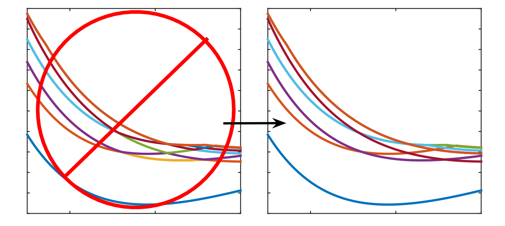

[SuaveStateScanner](#introduction) - A tool for excited electronic state labeling and continuity
================================================================================================

Table of Contents
-----------------
* [Introduction](#introduction)
* [Usage](#usage)
* [Arguments](#arguments)
* [Input File Format](#input-file-format)
* [Configuration File Format](#configuration-file-format)
* [Troubleshooting](#troubleshooting)
* [How to cite](#how-to-cite)


Introduction
------------

[SuaveStateScanner](#introduction) is a tool that labels and ensures the continuity of excited state potential energy curves (PECs) in electronic structure calculations. 
It assigns consistent labels to multiple states along PECs by enforcing the continuity of the excited-state energies and properties (i.e. transition dipole moments, oscillator strengths, norms of operators, etc.) along the reaction coordinate.

This script is particularly useful in cases where excited state energies are discontinuous with respect to their properties despite having continuous energies. 
This occurs when excited states are close/degenerate in energy, but have different properties (such as excited states with different symmetry). 
This script helps label and separate these states along the reaction coordinate.

While [SuaveStateScanner](#introduction) is targeted for use in quantum chemistry, it can also be used as a general mathematical tool for
separating and labeling sets of eigenvectors that have similar eigenvalues along some coordinate.


Usage
-----

Clone the repository and install the dependencies with:
``` bash
    pip install -r requirements.txt
```

To use this tool, run:
``` bash
    python suave_state_scanner.py [-c CONFIG_PATH] in_file out_file num_states
```

The required arguments are `in_file`, the input data file, `out_file`, the file to which the reordered states will be written, and `num_states`, the number of states in the input data. 

The optional argument `-c CONFIG_PATH` is the path to the configuration file. If not provided, default values will be used.

The script will generate the new energy ordering from `in_file` to `out_file`, with the reaction coordinate as the first row. 
During the reordering procedure, the files `checkpoint.csv` and `temp_out.csv` are generated. 
The `checkpoint.csv` file stores all the state information for each point and can be used to restart the script. 
The `temp_out.csv` file stores the output at any given iteration for the states, which can be used to track the progress of the reordering.

[SuaveStateScanner](#introduction) can also be called directly from python with the following:
``` python
    from suave_state_scanner.py import SuaveStateScanner
    scanner = SuaveStateScanner(infile="input.csv", outfile="output.csv", 
                                numStates, configPath="suave.json")
    if scanner.interactive:
        scanner.run_interactive()
    else:
        scanner.run()
```


Arguments
---------

* `infile` - The name of the input file. This file should contain a sequence of points for multiple states with energies
  and properties along a reaction coordinate. See the [Input File Format](#input-file-format) section for more details.


* `outfile` - The name of the output file. This file will be filled with rows corresponding to the reaction coordinate
  and then by state, with each state's energy printed along the columns.


* `numStates` - The number of states in the input file for each point in the reaction coordinate.


* `configPath` (optional) - This is the path to a configuration file that will set up parameters for the stencils used
  to enforce continuity of states. If not specified, default values will be set. 
  See the [Configuration File Format](#configuration-file-format) section for more details. (default: None)

Input File Format
-----------------

``` csv
    rc1 energy1 property1.1 property1.2 --->
    rc1 energy2 property2.1 property2.2 --->
                    |
                    V
    rc2 energy1 property1.1 property1.2 --->
    rc2 energy2 property2.1 property2.2 --->
```

The file is assumed to contain a sequence of points for multiple states with energies and properties. The file will be
filled with rows corresponding to the reaction coordinate and then by state, with the energy and properties of each state
printed along the columns. The first column must be the reaction coordinate. The second column must be the state's energy or some other target variable.
The remaining columns are the properties of the state. The number of states is specified by the user.

For data that is not perfectly square, the script will break. If it is not feasible to run further calculations,
the user can replace missing energies and/or properties with nan or inf. The script will ignore these points for 
calculating finite differences by interpolating over them (A warning message will indicate this). The final printed 
output will keep the nan or inf values in their corresponding locations and will not interpolate over them. 
However, the user should be aware that the script will still not effectively reorder states if there are too many nan or inf values used.

Configuration File Format
-------------------------

The configuration file is in JSON format. The following is an example configuration file:
``` json
    {
        "printVar": 0,
        "interactive": true,
        "maxiter": 1000,
        "orders": [1],
        "width": 3,
        "futurePnts": 0,
        "maxPan": 1,
        "stateBounds": null,
        "pntBounds": null,
        "propList": null,
        "sweepBack": false,
        "eBounds": null,
        "eWidth": null,
        "interpolate": false,
        "keepInterp": false,
        "nthreads": 1,
        "makePos": false,
        "normalize": false,
        "doShuffle": false,
        "maxStateRepeat": -1,
        "redundantSwaps": true
    }
```

All configurations in the configuration file are optional and are defined as follows:

* `printVar` - The index for the target property to be printed to the output file. If this is not specified, the
  default is to print the energy of the state. Other values will print a specific property for each state. Negative
  values will index from the end of the list of properties. (default: 0)


* `maxIter` - The maximum number of iterations to run the reordering procedure. (default: 1000)


* `interactive` - If this is set to True, the script will run in interactive mode. This will allow the user to
  perform reordering steps on the fly, modify bounds for states and points at each step, and save the current state. It
  will also allow the user to redraw states to plot different properties. This is useful for debugging, manipulating, 
  and for visualizing the reordering procedure. This setting is strongly recommended for debugging. (default: True)


* `orders` - The 'orders' parameter defines the orders of derivatives desired for computation. This parameter must be a list of integers.
   The default value '[1]' will be used if this parameter is not provided. (default: [1])


* `width` - The 'width' parameter defines the width of the stencil used for finite differences.
   This parameter is optional and must be a positive integer greater than the max order.
   If this parameter is not provided, the default value '3' or 'max(orders)+3' will be used. (default: 3)


* `futurePnts` - The 'futurePnts' parameter defines the number of points from the right of the center that is included in the stencils.
   This parameter is optional and must be a positive integer. If this parameter is not provided, 
   the default value '0' will be used. A zero/small value is ideal since the script reorders points from left to right; 
   points on the right will be unsorted making their derivatives mostly invalid (default: 0)


* `maxPan` - The 'maxPan' parameter defines the maximum number of times the stencil of size width can pivot 
   around the center point. This parameter is optional and must be a positive integer. If this parameter is not provided, 
   the default value 'None' will be used, meaning there is no limit to the pivoting of the stencil.  (default: None)


* `pntBounds` - The bounds of the points in the input file. If provided, this should be a list
  in the form [xmin, xmax] where xmin/xmax are the minimum/maximum index for the reaction coordinates (default: None)


* `propList` - A list of the indices of the properties to enforce continuity for. If provided, this should be a list
  of integers. The other properties will still be associated with each state despite not being used for reordering. 
  If this parameter is not provided, the default value 'None' will be used, meaning all properties will be used. (default: None)


* `sweepBack` - The 'sweepBack' parameter defines whether the script will sweep backwards through the points
   after it has finished sweeping forwards. This parameter is optional and must be a boolean. If this parameter is not provided, 
   the default value 'False' will be used. (default: False)


* `stateBounds` - The bounds of the states in the input file. If provided, this should be a
  list in the form [statemin, statemax] specifying inclusive lower and
  upper bounds on indices identifying individual electronic states to sort (e.g., if numStates=3 then
  stateBounds=[0, 1] would reorder only two out of three available electronic states). By default all available
  electronic states will be included in analysis/output unless stateBounds is specified otherwise. (default: None)


* `eBounds` - The bounds of the energies in the input file. If provided, this should be a list
  in the form [emin, emax] specifying inclusive lower and upper bounds on energies. By default all available
  energies will be included in analysis/output unless eBounds is specified otherwise. (default: None)


* `eWidth` - The 'eWidth' parameter defines the energy width for valid energies to swap with current state at a point.
   This parameter is optional and must be a positive float. If this parameter is not provided, 
   the default value 'None' will be used, meaning there is no limit to the energy width. (default: None)


* `interpolate` - The 'interpolate' parameter defines whether to linearly interpolate over nan or inf values. 
   This parameter is optional and must be a boolean. If this parameter is not provided, 
   the default value 'False' will be used. If False, the script will explicitly ignore the missing points when
   calculating finite differences. (default: False)


* `keepInterp` - The 'keepInterp' parameter defines whether to keep the interpolated missing points in the output file. 
   This parameter is optional and must be a boolean. If this parameter is not provided, 
   the default value 'False' will be used. Note: if this parameter is set to True, the missing points will not be identified
   in the output file. The interpolation is a cubic spline when saved to disk. (default: False)


* `maxStateRepeat` - The maximum number of times a state can be repeated without changes in reordering procedure. If this parameter is not provided, the default value '-1' will be used, meaning there is no limit to the number of times a state can be repeated. (default: -1)


* `nthreads` - The number of numba threads to use (default: 1)

* `makePos` - Whether to make all extracted properties positive when sorting. Making properties positive
  can sometimes improve performance on data processed by [SuaveStateScanner](#introduction) but isn't strictly necessary so
  default value is False. (default: False)

* `normalize` - Whether to normalize extracted properties when sorting. (default: False)

* `doShuffle` - Whether to shuffle order or energy eigenvalues along each curve sampled from electronic
  structure calculations or other types of calculations. Shuffling can sometimes improve performance on data processed
  by [SuaveStateScanner](#introduction) as input but isn't strictly necessary so default value is False. (default: False)


* `redundantSwaps` - Whether to allow redundant swaps. If set to False, a state will only be considered for swapping with higher lying states. 
  This improves performance since fewer states are incorporated into the derivatives. Lower lying states should already be in the correct order after a few iterations. 
  However, depending on the data, this may not be the case and the script may not converge. (default: True)

Troubleshooting
------------
If your data is not converging and/or the order of states is not accurate, there are a few things you can try:

- Make sure that your data is continuous at each point and that the points are closely spaced. This tool will not work well with discontinuous data or has widely spaced points.
    - You can use the `interactive` mode to visualize the data and check for discontinuities for the energy and properties.

- Try changing the configuration parameters in the config file. You can experiment with different values for the 'orders', 'width', 'cutoff', and 'maxPan' parameters to see if that helps convergence and accuracy. 

    - In almost all cases, the default value of [1] for `orders` gives the correct behavior. This value should be the last to be experiemented with.
    - It's usually ideal to have a large width with a small spacing of points; this helps capture more local information of the state. However, this will increase the cost of reordering. 
    - The `cutoff` should be small since points towards the right will often be sorted inaccurately, however sometimes a value greater than 1 may give better results.
    - The `maxPan` value defaults to None which puts no limits on how much the sliding window for finite differences pivots around a central point. It can help to set a small value for this, so fewer combinations of points are considered to compute the change of energy w.r.t a state swapping.
    - The `futurePnts` parameter should almost always be set to 0. This parameter is used to include points on the right of the center point in the stencil. However, these points are not sorted and will often give inaccurate derivatives.
    - Setting redundantSwaps to True will allow the algorithm to swap the current state with lower lying states. This should not be necessary in most cases, but can be useful for troubleshooting.

- Experiment with using different properties to describe each state. Some properties will contribute more to the calculation of the finite differences than others, or some properties may be less continuous than others at each point (i.e. x-, y- transition dipoles that can mix arbitrarily for c1-symmetry calculations). It may help to normalize all properties for each state so properties are treated on equal footing or enable the `makePos` flag in the config file to eliminate dependence on sign.

- Try shuffling the order of energy eigenvalues for each state along each point sampled from electronic structure calculations or other types of calculations. This can sometimes improve performance on data processed by [SuaveStateScanner](#introduction) as input, where parameters from the initial configuration prevents states from being swapped. To do this, simply set the `doShuffle` parameter to True in the config file.

- Consider sorting the states in batches with different bounds for the points `pntBounds`, states `stateBounds`, and energies (`eBounds` and/or `eWidth`). This can help to identify the correct order of states for each batch, which can then be used to sort the entire data set.
  - For example, if you have a data set with 1000 points, you can sort the first 100 points with `pntBounds=[0, 99]` and then sort the next 100 points with `pntBounds=[100, 199]` and so on. This will help to identify the correct order of states for each batch, which can then be used to sort the entire data set.
  - If using the `interactive` mode, you can use the `pntBounds` slider to set a custom range of points at each step of the algorithm. Similarly, you can use the `stateBounds` slider to set a custom range of states at each step of the algorithm. 

- For problematic points that cause the script to fail, you can try to manually reorder the states at that point. This can be done by editing the input file and changing the order of the states at that point. The script will then use this new order as the starting point for its reordering procedure.

- Additionally, you can set the energy and properties of the problematic points to 'nan' in the input file. The script will then ignore these points, either explicitly or via interpolation `interpolate`, and will not try to reorder the states at these points. Unless the `keepInterp` or `interpolate` parameter is set to True, the script will not print the nan/inf points in the output file (those points will have 'nan' for the energy and properties).

- A large problem comes from the definition of the metric for when states should be swapped or not. This is determined by the `getMetric` function in `suave_metric.py`. 
  Depending on your data, you may need to change this function to get the correct behavior. The current metric is defined as:

``` python
def getMetric(dE, dP):
    """
    This function computes the ordering metric for a given set of finite differences.
    :param dE: the finite differences of the energies at the current point (shape: (numStates))
    :param dP: the finite differences of the properties at the current point (shape: (numStates, numFeatures))
    :return the ordering metric for the given finite differences
    """

    # reduce dP to a single vector
    dP = dP @ np.ones(dP.shape[1])

    return (dE * dP).sum()
```

- If you are still having trouble, please contact me at my [email](mailto:mliebenthal@fsu.edu) or submit a ticket and I will try to help you out.

Make sure to plot the guess ordering at different iterations from the 'tempOutput.csv' file. This can help you recognize if a set of parameters will work or not before waiting for the reordering procedure to terminate. The reordering procedure will repeat the scan over all points for the number of points squared, or until no more state swaps improve the continuity at each point. For degenerate states with identical properties, this can sometimes cause issues where the two states swap with each other arbitrarily for each scan. In this case, it is ideal to terminate the calculation and use tempOutput.csv as the final result.

How to cite
-----------

When using [SuaveStateScanner](#introduction) for research projects, please cite:

```
@misc{SuaveStateScanner,
    author       = {Marcus Dante Liebenthal},
    title        = {{SuaveStateScanner}: https://github.com/Marclie/SuaveStateScanner},
    month        = {August},
    year         = {2022},
    url          = {https://github.com/Marclie/SuaveStateScanner} 
}
```
